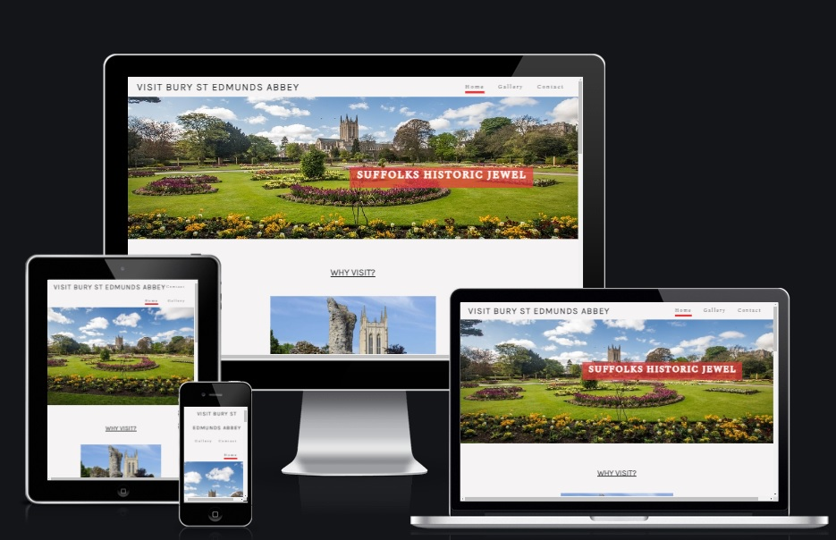
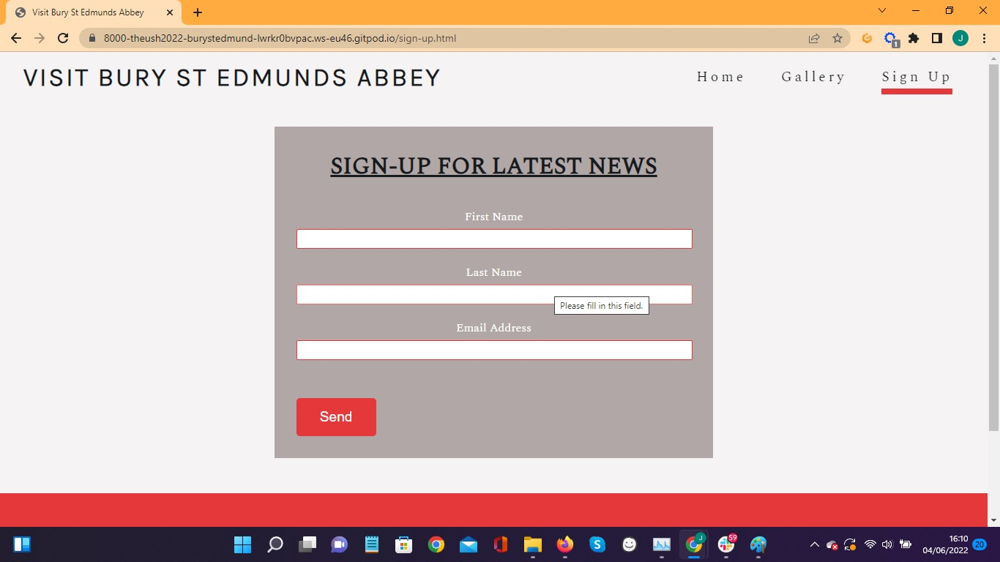

# Visit Bury St Edmunds Abbey

Visit Bury St Edmunds Abbey is a site that hopefully shows the beauty annd attractions of a historical landmark in Bury St Edmunds. The website is mainly targetted towards tourists who are unaware of the Abbey and it's amazing sights.

For a link to this website click [here](https://theush2022.github.io/Bury-St-Edmunds-Abbey/index.html)

## What does this website do?

This website shows three main areas of potential interest for tourists. The three potenial tourist spots are the Abbey Ruins, Abbey Gardens & St Edmundsbury Cathedral with key features detailed and ontact information for tours or questions.

## UX 5 Planes

### Strategy Plane

The website is quite simple and direct for ease of use for visitors.

### Scope Plane

In this project You can find the following features:
* The header and footer are kept uniform on all pages.
* The following three pages:

- Home page showing firstly a hero image of the Abbey Gardens and subsequent images of the potential tourist spots with brief descriptions. Also included is a map with a location and tourist information contact details.

- Gallery page showing various images of of tourist spots for users to look at.

- Sign Up page allowing users to receive latest Bury St Edmunds Abbey news/updates.

### Structure Plane

The three pages allow users both see and read about what's available at the Abbey so they can make a decision on what they want to see and who to contact for a tours/questions.

### Skeleton Plane

Initially designed for desktop/laptop usage but adapted for mobile & tablet users also.

### Surface Plane

* Colors

I wanted the webiste to appear both welcoming and gentle with a light grey background #f5f3f4 but with some bold coloring for contrast. I used light-red #e5383b underlining the active pages on the navagation menu and for som styling on the sign up page. I went for a very dark grey #161a1d for the headers and text.

* Typography

I used two font types from https://fonts.google.com/ with pairing advice from https://www.fontpair.co/pairing/spectral-and-karla

**Spectral** (weight: 300)

**Karla** (weight: 300)

## Features

### Existing Features

* Created in HTML5 and CSS3
* Three different pages

### Features for future implementation

* Interactive time-line of historical events
* Drone footage of the Abbey
* Image compression for quicker load times

## Technologies Used

- HTML5 for for webiste structure
- CSS3 for styling the website
- Google Fonts for fonts families
- Font Awesome for social media icons
- Git for version control
- GitHub for storing the website files and deployment.

## Resources

- Code Institute course and challenge tasks.
- Code Institute Slack threads for support
- Code Institute Mentor for guidance and support.
- https://www.burystedmunds-tc.gov.uk for Abbey images.
- https://coolors.co for color ideas.

## Testing

### Browser testing

Website fully tested on Google Chrome, Microsoft Edge, Opera & Safari & various mobile/tablet sizes via Google Dev Tools.

### Validators

Checks performed on website with no issues by W3C HTML & CSS validators -

### Responsiveness

By using Google Dev tools I checked the responsiveness on other devices othern than desktop including mobile devices. As a result, my home page cover text was adjusted in the css stylesheet to suit smaller screens.

Example audits via lighthouse:

Desktop Audit

Mobile Audit

## Version control

Two repositories were used for this websites development. Gitpod for local purposes and Github for a remot/background repository.

I managed the versions with the followung process:
- Repository created in Github
- I opened the repository in Gitpod and used this for development purposes.
- Files were added and developed in Gitpod.
- Using the following commands I pushed my work to the to GitHub repository:
    1. git add . - adds a change in the working directory to the staging area
    2. git commit -m "Commit message" - captures a snapshot of the project's currently staged changes
    3. git push - to upload local repository content to a remote repository

## Publish the project

Steps for deployment/publishing on the GitHub were as follow:
    
    1. "Settings" on the project repository
    2. "Pages" then scroll to source then ensure "Main" selected as branch then save.
    3. The website is then published and the link made available on the same Github page.

